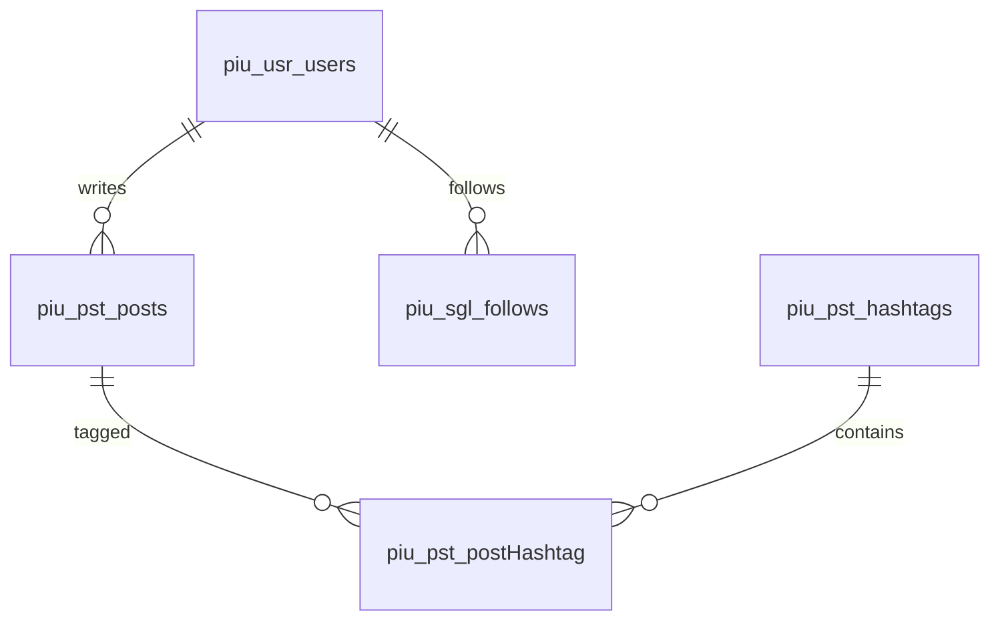

# Modelo de Dados – PIU

Documento descrevendo todas as entidades, relacionamentos e regras do modelo.

---

## 🎯 Princípios

- Modelo relacional  
- Convenções PIU  
- Domínios  
- Índices  
- IA com vetores  

---

## 🗂️ Entidades

1. Usuarios  
2. Posts  
3. Hashtags  
4. Likes  
5. Seguidores  
6. Notificações  
7. DMs  
8. Denúncias  
9. Shortlinks  
10. Vetores  

---

## 📊 Diagrama ER (Mermaid)

