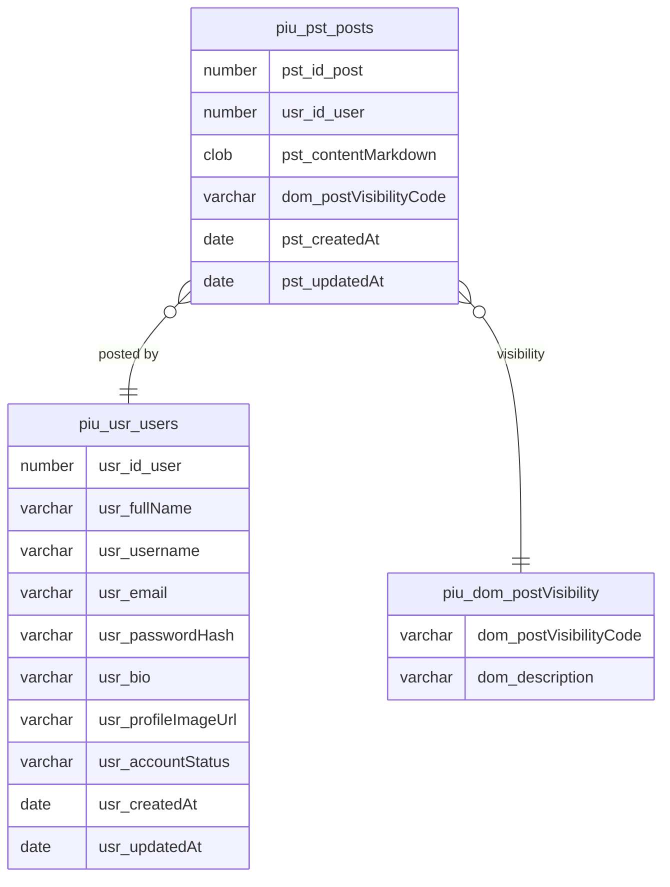

# PIU — Post, Interact, Unite

PIU é uma rede social experimental construída como projeto de estudo para:
- **Modelagem de dados avançada**
- **Oracle Database 23ai**
- **Oracle APEX**
- **IA nativa do banco (vetores, embeddings e semântica)**
- **Boas práticas de desenvolvimento full-stack**

Inspirado em redes como Threads e X (antigo Twitter), PIU é um ambiente prático para explorar
técnicas modernas de design de software, arquitetura de dados e prototipação rápida.

---

## 🌱 Estado Atual do Projeto

O projeto encontra-se atualmente em **Fase 3 – MVP**.

### ✔️ Concluído
- Configuração completa de ambiente Oracle + APEX  
- Criação do workspace PIU  
- Criação do schema `piu_owner` com todos os grants necessários  
- Criação de todas as 16 tabelas do modelo de dados  
- Criação das triggers, PKs, FKs e índices  
- Documentação via `COMMENT ON`  
- Geração de seed data: usuários e 50 posts  
- View de timeline com conversão CLOB → Preview  
- Roadmap completo incluído no repositório  

### 🚧 Em andamento
- Construção da aplicação APEX (MVP)  
- Formulário de criação de posts  
- Página de timeline  
- Página de perfil  

---

## 🗺️ Roadmap Completo

O roadmap detalhado está disponível em  
[`ROADMAP.md`](./ROADMAP.md)

---

## 🧱 Modelo de Dados (MER)

Diagrama ER em Mermaid:

---

## 🧪 Seed Data

Usuários iniciais:

- **gabriel** – criador do PIU  
- **helena** – fotógrafa e urbanista  
- **epifanio** – personagem literário e comentarista político  

---

## 🧭 Como Rodar

1. Configurar workspace + schema  
2. Rodar DDL  
3. Rodar DML  
4. Criar app no APEX  
